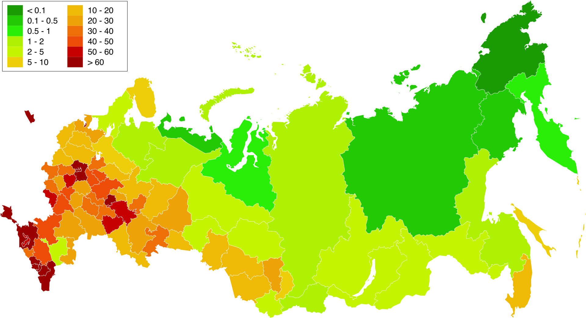
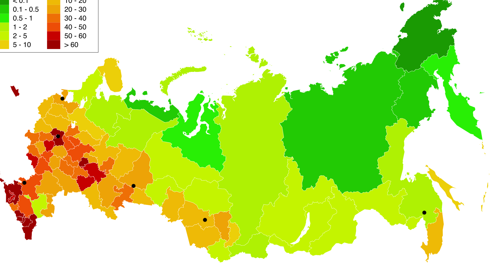

# Проектирование высоконагруженной электронной энциклопедии

Курсовая работа в рамках 3-го семестра программы по Веб-разработке Образовательного центра VK x МГТУ им.Н.Э.Баумана (ex. "Технопарк") по дисциплине "Проектирование высоконагруженных систем" ставит перед собой цель детального проектирования высоконагруженной системы. Темой работы является проектирование сервиса, схожего по функционалу с Википедией.

В рамках работы предполагается изучить и применить принципы разработки высоконагруженных веб-приложений, включая выбор подходящей архитектуры, оптимизацию производительности и масштабируемость системы. Важным аспектом является обеспечение способности системы справляться с большим количеством одновременных запросов и пользователей, что критично для сервисов, где ожидается высокая нагрузка.

## Содержание

- ### [1. Тема, целевая аудитория и функционал](#1_part)
- ### [2. Расчет нагрузки](#2_part)
- ### [3. Глобальная балансировка нагрузки](#3_part)
- ### [4. Локальная балансировка нагрузки](#4_part)
- ### [5. Логическая схема БД](#5_part)
- ### [6. Физическая схема БД](#6_part)
- ### [7. Алгоритмы](#7_part)
- ### [8. Технологии](#8_part)
- ### [9. Обеспечение надежности](#9_part)
- ### [10. Схема проекта](#10_part)
- ### [11. Расчет ресурсов](#11_part)
- ### [Список источников](#sources)

---

## 1. Тема, целевая аудитория и функционал 

### Тема

Википедия - это веб-сайт, представляющий собой свободную энциклопедию, которую создают и редактируют добровольцы со всего мира. Это один из крупнейших источников информации в Интернете ввиду своей уникальной модели коллективного редактирования и открытости. Он содержит огромное количество статей по различным темам: от науки и истории до культуры и техники.

### Целевая аудитория

- 133 000 000 активных пользователей в месяц
- 4 500 000 активных пользователей в день
- 3 500 000 зарегистрированных пользователей

#### Читатели

- средний возраст - 36 лет
- 55% читателей - мужчины, 45% - женщины

#### Зарегистрированные пользователи

- 84% редакторов - мужчины
- 59% редакторов в возрасте от 17 до 40 лет, а 13% - в возрасте 16 лет и младше

Продукт рассчитан на СНГ рынок, поэтому рассмотрим региональную аудиторию подробнее.

#### Распределение пользователей по странам

| Страна    | %   | чел        |
| --------- | --- | ---------- |
| Россия    | 67  | 89 100 000 |
| Украина   | 11  | 14 600 000 |
| Беларусь  | 4   | 5 300 000  |
| Казахстан | 3   | 4 000 000  |
| Другое    | 15  | 20 000 000 |

### Основной функционал

1. Просмотр статей
2. Создание и редактирование статей
3. Регистрация и аутентификация пользователей
4. Поиск
5. Комментарии

---

## 2. Расчет нагрузки 

### Продуктовые метрики

- MAU: 133 000 000
- DAU: 4 500 000
- Среднее время на сайте: 00:03:58
- Среднее количество посещенных страниц за сессию: 3.45

#### Среднее количество действий пользователя по типам в день

Рассчитаем количество действий пользователя по следующим типам:

_Создание и редактирование статей_

Среднее количество правок на страницу равно 20. Таким образом общее количество запросов на создание и обновление статьи в 21 раз больше, чем на создание.

Количество новых статей в день равно 158, следовательно, RPD на ручку создания и редактирования статьи равно 158 \* (1 + 20) = 3 318

_Поиск_

Известно, что среднее количество страниц, посещенных пользователем за одну сессию равно 3,45. На основе личного опыта предположим, что около 1 страницы пользователь находит по поиску, а 2,45 страницы открывает по ссылкам из текущей страницы. Таким образом (1 / 3,45) \* 100% = 29% статей открываются из поиска, а 100% - 29% = 71% открываются по прямым ссылкам.

Отсюда имеем следующее число действий в день: поскольку число просмотренных статей в день равно 30 млн, то число поисковых запросов равно 30 000 000 \* 0,29 = 8 700 000

_Комментарии_

Для рассчета данных о количестве комментариев воспользуемся статистикой сервиса Дзен, схожего по формату с Википедией. Среднее количество комментариев под постами Дзен равно 40. MAU Дзен равна = 81 000 000. Таким образом, расчитаем предполагаемое количество комментариев под статьями нашего сервиса: 40 \* (133 000 000 / 81 000 000) = 66.

Так как количество новых статей в день равно 158, то число комментариев в день равно 66 \* 158 = 10 428.

| Действие                         | Количество |
| -------------------------------- | ---------- |
| Просмотр статей                  | 30 000 000 |
| Создание + редактирование статей | 3 318      |
| Регистрация и аутентификация     | 310        |
| Поиск                            | 8 700 000  |
| Комментарии                      | 10 428     |

### Технические метрики

#### Общие данные

| Тип                             | Количество |
| ------------------------------- | ---------- |
| Статьи                          | 2 000 000  |
| Загруженные файлы               | 250 000    |
| Изменения статей                | 40 000 000 |
| Зарегистрированные пользователи | 3 500 000  |

#### Размер сущностей

<u>Информация о фотографии</u>

В рекомендациях сайта Википедия указывается, что не стоит загружать фотографии, размер которых превышает 35кб. Примем это за средний размер фотографии.

<u>Информация о профиле</u>

Несмотря на все важные текстовые поля, фото будет составлять бóльшую часть веса, поэтому будем считать, что размер данных профиля равен 40кб.

<u>Информация о статье</u>

Под данным Википедии, среднее количестьво слов в статье на ее ресурсе равно 532, а средняя длина слова - 5 символов. 1 символ в Unicode кодируется 2 байтами.

Поскольку общее число статей на ru.wikipedia.org равно 2 000 000, а количество файлов (фотографий) равно 250 000, то среднее число фотографий в статье равно 250 000 / 2 000 000 = 0,125.

Статья тажкже имеет ID - 16б (UUID).

Итого, имеем: 532 \* 5 \* 2 + 0,125 \* 40 \* 1024 + 16 = 5320 + 5120 + 16 = 10 456б

<u>Информация о комментарии</u>

Примем, что в среднем 1 сообщение содержит 50 символов. 1 символ в Unicode кодируется 2 байтами. Сообщение также имеет ID - 16б, дату создания - 4б и ID статьи - 16б. Итого, имеем 50 \* 2 + 16 + 4 + 16 = 136б.

#### Сводная таблица объема памяти по типовым действиям

| Тип                             | Количество | Объем памяти за все время | Объем памяти за год |
| ------------------------------- | ---------- | ------------------------- | ------------------- |
| Статьи                          | 2 000 000  | 19,47 Гб                  | 575 Мб              |
| Загруженные файлы               | 250 000    | 8,34 Гб                   | 5,05 Гб             |
| Изменения статей                | 40 000 000 | 389,5 Гб                  | 11,34 Гб            |
| Зарегистрированные пользователи | 3 500 000  | 133,5 Гб                  | 4,32 Гб             |
| Комментарии                     | 12 000 000 | 1,52 Гб                   | 494 Мб              |
| Итого                           | -          | 552,33 Гб                 | 21,75 Гб            |

<u>Рассчитаем годовой прирост памяти</u>

Создание статей:

365 \* 158 \* 10 456 = 575 Мб

Изменение статей:

365 \* 158 \* 20 \* 10 456 = 11,34 Гб

Загрузка файлов:

365 \* 415 \* 35 \* 1024 = 5,05 Гб

Регистрация пользователей:

365 \* 310 \* 40 \* 1024 = 4,32 Гб

Комментарии:

365 \* 10 428 \* 136 = 494 Мб

Итого:

0,56 + 11,34 + 5,05 + 4,32 + 0,48 = 21,75 Гб

#### Сетевой трафик

| Тип трафика                      | Пиковое потребление | Средний трафик |
| -------------------------------- | ------------------- | -------------- |
| Просмотр статьи                  | 46,26 Мбит/с        | 27,7 Мбит/с    |
| Загрузка файлов                  | 2,37 Мбит/с         | 1,42 Кбит/с    |
| Создание / редактирование статей | 5,23 Мбит/с         | 3,13 Кбит/с    |
| Регистрация / аутентификация     | 1,9 Мбит/с          | 1,14 Кбит/с    |
| Комментарии                      | 0,33 Мбит/с         | 0,2 Кбит/с     |
| Поиск                            | 268,3 Мбит/с        | 160,7 Мбит/с   |

<u>Суммарный суточный трафик</u>

Просмотр статьи:

10 456 \* 30 000 000 = 292,14 Гб

Загрузка файлов:

35 \* 1024 \* 415 = 15 Мб

Создание / редактирование статей:

10 456 \* 3 318 = 33 Мб

Регистрация / аутентификация:

40 \* 1024 \* 310 = 12 Мб

Комментарии:

136 \* 10 428 = 2 Мб

Поиск:

В среднем на 1 поисковый запрос Википедия отдает 20 статей. По данным этого наблюдения рассчитаем сетевой трафик поисковой ручки:

20 \* 10 456 \* 8 700 000 = 1 694,4 Гб

Возьмем коэффициент отношения пикового трафика к среднему равным 1,67, и на его основе рассчитаем пиковое потребление.

#### RPS

Вспомним, что по проведенным ранее подсчетам, среднее количество фотографий в статье равно 0,125. Таким образом RPD для загрузки фото равно 3 318 \* 0,125 = 415, следовательно RPS равно 415 / 86 400 = 0,005.

| Тип запроса                      | RPD        | RPS (/ 86 400) |
| -------------------------------- | ---------- | -------------- |
| Просмотр статьи                  | 30 000 000 | 347            |
| Загрузка файлов                  | 415        | 0,005          |
| Создание / редактирование статей | 3 318      | 0,04           |
| Регистрация / аутентификация     | 310        | 0,004          |
| Поиск                            | 8 700 000  | 101            |
| Комментарии                      | 10 428     | 0,12           |
| Всего                            | 39 000 000 | 451            |

---

## 3. Глобальная балансировка нагрузки 

### Расположение датацентров

Так как большая часть аудитории Википедии располагается в России, то все датацентры располагать будем также в России.

Из-за неравномерного распределения плотности населения России большая часть датацентров будет располагаться в европейской части. Но из-за большой протяженности России ЦОД-ы будут находиться также в южной части Сибири и Дальнего Востока в местах наибольшей плотности населения.

Проанализаруем <u>карту России с плотностью населения по субъектам</u>:

а также <u>карту магистральных сетей связи</u> :

На их основе выберем города, которые лучше всего подойдут под расположение датацентров. Будем учитывать раположение, плотность населения, наличие большого количества магистральных сетей связи.

Таким образом, города, в которых будут расположены датацентры:

- Москва
- Санкт-Петербург
- Ростов-на-Дону
- Екатеринбург
- Новосибирск
- Хабаровск

Имеем следующее расположение ЦОД-ов:

### Глобальная балансировка

С помощью GeoDNS будем определять физически ближайший к пользователю ЦОД. ЦОД-ы будут отвечать за следующие районы:

- Хабаровск -> Дальний Восток, ДВФО
- Новосибирск -> Сибирь, СФО
- Ростов-на-Дону -> Европейская часть России, ЮФО, СКФО, ПФО
- Екатеринбург -> Европейская часть России, УрФО, ПФО
- Москва -> Москва, Московская область, ЦФО
- Санкт-Петербург -> Санкт-Петербург, Ленинградская область, СЗФО

Затем балансировку можно производить помощью BGP Anycast. Это позволит внутри каждого из районов выбрать наиболее подходящий по маршрутным метрикам ЦОД.

### Анализ нагрузки на ЦОД-ы

#### Время отклика сервера

Для подтверждения гипотезы о корректном расположении датацентров проверим время отклика из разных городов, и убедимся в том, что оно остается в допустимых пределах. Возьмем ключевые точки, которые наиболее отдалены от ЦОД-ов, и проверим время отклика:

- Камчатка - Хабаровск: 33 мс
- Иркутск - Екатеринбург: 27 мс
- Казань - Екатеринбург: 15 мс
- Владикавказ - Ростов-на-Дону: 19 мс

Время отклика не превышает 50 мс, а это означает, что раположение датацентров выбрано удачно.

#### Нагрузка на ЦОД-ы

Рассчитаем предполагаемую нагрузку на ЦОД-ы. Будем исходить из того, что RPD на MVP составляет 39 000 000. Рассмотрим плотность населения России и распределение регионов по серверам, и на этой основе рассчитаем преполагаемое количество RPD на каждый из ЦОД-ов.

| ЦОД             | Регион                                 | Население  | % от населения России | Нагрузка (RPD) |
| --------------- | -------------------------------------- | ---------- | --------------------- | -------------- |
| Москва          | Москва, Московская область             | 40 240 256 | 27,64                 | 10 779 600     |
| Санкт-Петербург | Санкт-Петербург, Ленинградская область | 13 867 347 | 9,53                  | 3 716 700      |
| Ростов-на-Дону  | Европейская часть, Юг России           | 34 642 052 | 23,8                  | 9 282 000      |
| Екатеринбург    | Европейская часть России               | 32 259 126 | 22,16                 | 8 642 400      |
| Новосибирск     | Сибирь                                 | 16 645 802 | 11,44                 | 4 461 600      |
| Хабаровск       | Дальний Восток                         | 7 903 864  | 5,43                  | 2 117 700      |
| Итого           | Россия                                 | 145558447  | 100                   | 39000000       |

---

## 4. Локальная балансировка нагрузки 

Для обеспечения отказоустойчивости в случае падения одной из нод, будем использовать программное обеспечение
keepalived с использованием протокола VRRP. Это позволит мониторить доступность нод, а в случае отказа одной
из них перенаправить трафик на другую ноду.

Для проверки работоспособности сервера можем использовать readiness и liveness пробы.
С помощью readiness будем проверять готовность сервера принимать трафик.
С помощью liveness будем проверять, работает ли наше приложение.

На уровне L4 можно использовать nginx, который позволит распределить трафик между несколькими серверами.

На уровне L7 будем использовать балансировщик Google Cloud Internal HTTP(S) Load Balancing (L7 Load Balancing). Это управляемый сервис, основанный на прокси Envoy. Envoy может использоваться как L7 балансировщик нагрузки. Он позволяет балансировать трафик между сервисами на основе URL пути, что является распространенным случаем использования в микросервисной архитектуре. Это делает его мощным инструментом для балансировки нагрузки.

---

## 5. Логическая схема БД 

---

## 6. Физическая схема БД 

---

## 7. Алгоритмы 

---

## 8. Технологии 

---

## 9. Обеспечение надежности 

---

## 10. Схема проекта 

---

## 11. Расчет ресурсов 

---

## Список источников 

- ### [Анализ веб-сайта Wikipedia](https://hypestat.com/info/ru.wikipedia.org)

- ### [Анализ действий пользователей Wikipedia](https://pageviews.wmcloud.org/siteviews/?platform=all-access&source=pageviews&agent=user&start=2024-01-25&end=2024-02-25&sites=ru.wikipedia.org)

- ### [Плотность населения субъектов Российской Федерации](https://ru.wikipedia.org/wiki/%D0%9F%D0%BB%D0%BE%D1%82%D0%BD%D0%BE%D1%81%D1%82%D1%8C_%D0%BD%D0%B0%D1%81%D0%B5%D0%BB%D0%B5%D0%BD%D0%B8%D1%8F_%D1%81%D1%83%D0%B1%D1%8A%D0%B5%D0%BA%D1%82%D0%BE%D0%B2_%D0%A0%D0%BE%D1%81%D1%81%D0%B8%D0%B9%D1%81%D0%BA%D0%BE%D0%B9_%D0%A4%D0%B5%D0%B4%D0%B5%D1%80%D0%B0%D1%86%D0%B8%D0%B8)

- ### [Магистральные сети связи в России](https://www.comnews.ru/content/211042/2020-10-21/2020-w43/magistralnye-seti-svyazi-rossii)

- ### [IP разных городов](https://ip.osnova.news/ip/)

- ### [Проверка пинга](https://ping-admin.ru/free_ping/)

- ### [Федеральные округа России](https://ru.wikipedia.org/wiki/%D0%A4%D0%B5%D0%B4%D0%B5%D1%80%D0%B0%D0%BB%D1%8C%D0%BD%D1%8B%D0%B5_%D0%BE%D0%BA%D1%80%D1%83%D0%B3%D0%B0_%D0%A0%D0%BE%D1%81%D1%81%D0%B8%D0%B9%D1%81%D0%BA%D0%BE%D0%B9_%D0%A4%D0%B5%D0%B4%D0%B5%D1%80%D0%B0%D1%86%D0%B8%D0%B8)
