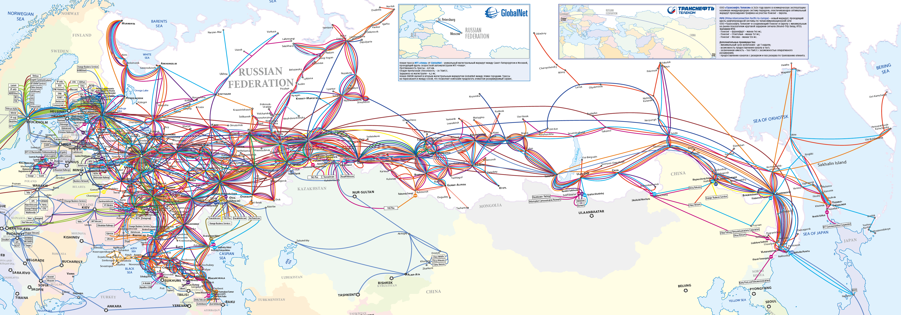
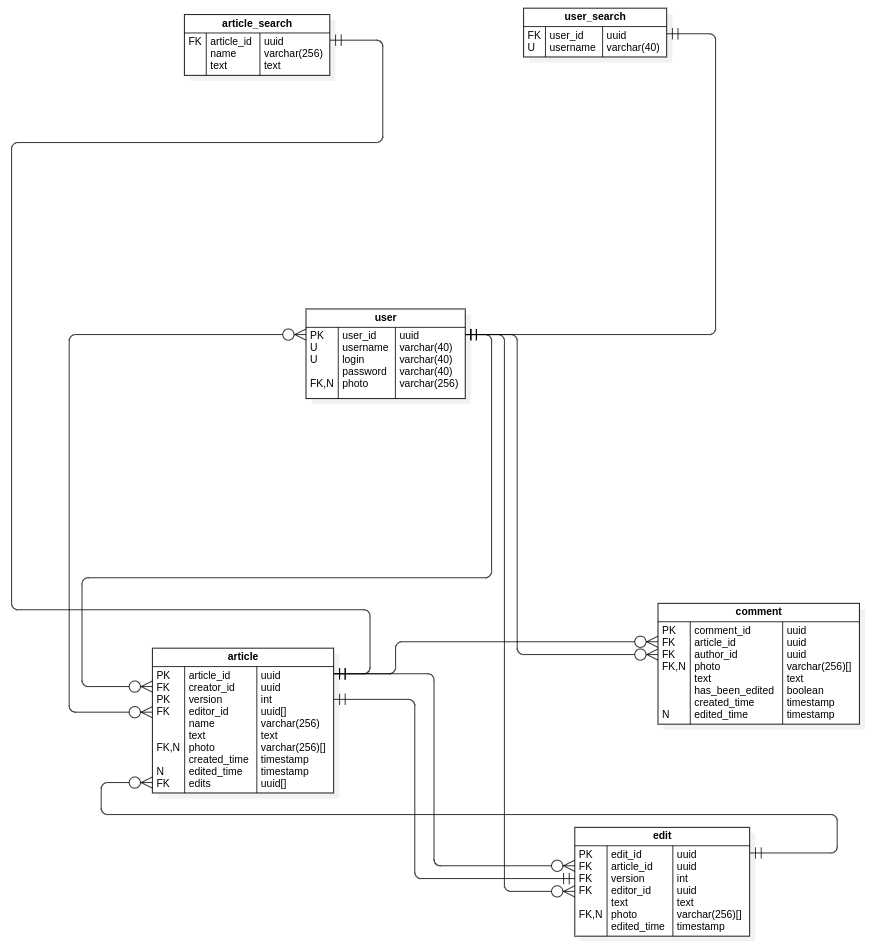
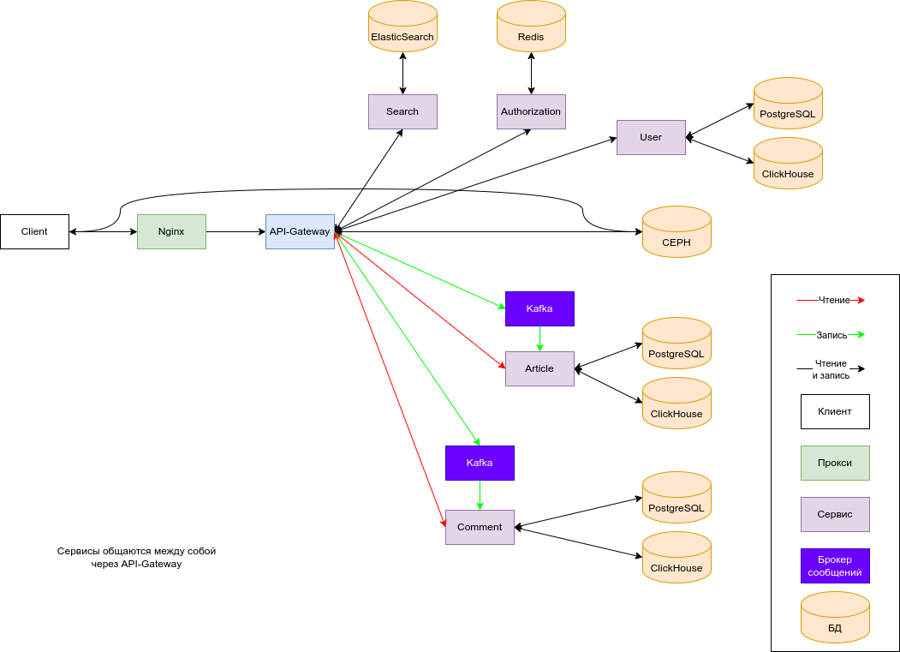

# Проектирование высоконагруженной электронной энциклопедии

Курсовая работа в рамках 3-го семестра программы по Веб-разработке Образовательного центра VK x МГТУ им.Н.Э.Баумана (ex. "Технопарк") по дисциплине "Проектирование высоконагруженных систем" ставит перед собой цель детального проектирования высоконагруженной системы. Темой работы является проектирование сервиса, схожего по функционалу с Википедией.

В рамках работы предполагается изучить и применить принципы разработки высоконагруженных веб-приложений, включая выбор подходящей архитектуры, оптимизацию производительности и масштабируемость системы. Важным аспектом является обеспечение способности системы справляться с большим количеством одновременных запросов и пользователей, что критично для сервисов, где ожидается высокая нагрузка.

## Содержание

- ### [1. Тема, целевая аудитория и функционал](#1_part)
- ### [2. Расчет нагрузки](#2_part)
- ### [3. Глобальная балансировка нагрузки](#3_part)
- ### [4. Локальная балансировка нагрузки](#4_part)
- ### [5. Логическая схема БД](#5_part)
- ### [6. Физическая схема БД](#6_part)
- ### [7. Алгоритмы](#7_part)
- ### [8. Технологии](#8_part)
- ### [9. Обеспечение надежности](#9_part)
- ### [10. Схема проекта](#10_part)
- ### [11. Расчет ресурсов](#11_part)
- ### [Список источников](#sources)

---

## 1. Тема, целевая аудитория и функционал 

### Тема

Википедия - это веб-сайт, представляющий собой свободную энциклопедию, которую создают и редактируют добровольцы со всего мира. Это один из крупнейших источников информации в Интернете ввиду своей уникальной модели коллективного редактирования и открытости. Он содержит огромное количество статей по различным темам: от науки и истории до культуры и техники.

### Целевая аудитория

- 133 000 000 активных пользователей в месяц
- 4 500 000 активных пользователей в день
- 3 500 000 зарегистрированных пользователей

#### Читатели

- средний возраст - 36 лет
- 55% читателей - мужчины, 45% - женщины

#### Зарегистрированные пользователи

- 84% редакторов - мужчины
- 59% редакторов в возрасте от 17 до 40 лет, а 13% - в возрасте 16 лет и младше

Продукт рассчитан на СНГ рынок, поэтому рассмотрим региональную аудиторию подробнее.

#### Распределение пользователей по странам

| Страна    | %   | чел        |
| --------- | --- | ---------- |
| Россия    | 67  | 89 100 000 |
| Украина   | 11  | 14 600 000 |
| Беларусь  | 4   | 5 300 000  |
| Казахстан | 3   | 4 000 000  |
| Другое    | 15  | 20 000 000 |

### Основной функционал

1. Просмотр статей
2. Создание и редактирование статей
3. Регистрация и аутентификация пользователей
4. Поиск
5. Комментарии

---

## 2. Расчет нагрузки 

### Продуктовые метрики

- MAU: 133 000 000
- DAU: 4 500 000
- Среднее время на сайте: 00:03:58
- Среднее количество посещенных страниц за сессию: 3.45

#### Среднее количество действий пользователя по типам в день

Рассчитаем количество действий пользователя по следующим типам:

_Создание и редактирование статей_

Среднее количество правок на страницу равно 20. Таким образом общее количество запросов на создание и обновление статьи в 21 раз больше, чем на создание.

Количество новых статей в день равно 158, следовательно, RPD на ручку создания и редактирования статьи равно 158 \* (1 + 20) = 3 318

_Поиск_

Известно, что среднее количество страниц, посещенных пользователем за одну сессию равно 3,45. На основе личного опыта предположим, что около 1 страницы пользователь находит по поиску, а 2,45 страницы открывает по ссылкам из текущей страницы. Таким образом (1 / 3,45) \* 100% = 29% статей открываются из поиска, а 100% - 29% = 71% открываются по прямым ссылкам.

Отсюда имеем следующее число действий в день: поскольку число просмотренных статей в день равно 30 млн, то число поисковых запросов равно 30 000 000 \* 0,29 = 8 700 000

_Комментарии_

Для рассчета данных о количестве комментариев воспользуемся статистикой сервиса Дзен, схожего по формату с Википедией. Среднее количество комментариев под постами Дзен равно 40. MAU Дзен равна = 81 000 000. Таким образом, расчитаем предполагаемое количество комментариев под статьями нашего сервиса: 40 \* (133 000 000 / 81 000 000) = 66.

Так как количество новых статей в день равно 158, то число комментариев в день равно 66 \* 158 = 10 428.

| Действие                         | Количество |
| -------------------------------- | ---------- |
| Просмотр статей                  | 30 000 000 |
| Создание + редактирование статей | 3 318      |
| Регистрация и аутентификация     | 310        |
| Поиск                            | 8 700 000  |
| Комментарии                      | 10 428     |

### Технические метрики

#### Общие данные

| Тип                             | Количество |
| ------------------------------- | ---------- |
| Статьи                          | 2 000 000  |
| Загруженные файлы               | 250 000    |
| Изменения статей                | 40 000 000 |
| Зарегистрированные пользователи | 3 500 000  |

#### Размер сущностей

<u>Информация о фотографии</u>

В рекомендациях сайта Википедия указывается, что не стоит загружать фотографии, размер которых превышает 35кб. Примем это за средний размер фотографии.

<u>Информация о профиле</u>

Несмотря на все важные текстовые поля, фото будет составлять бóльшую часть веса, поэтому будем считать, что размер данных профиля равен 40кб.

<u>Информация о статье</u>

Под данным Википедии, среднее количестьво слов в статье на ее ресурсе равно 532, а средняя длина слова - 5 символов. 1 символ в Unicode кодируется 2 байтами.

Поскольку общее число статей на ru.wikipedia.org равно 2 000 000, а количество файлов (фотографий) равно 250 000, то среднее число фотографий в статье равно 250 000 / 2 000 000 = 0,125.

Статья тажкже имеет ID - 16б (UUID).

Итого, имеем: 532 \* 5 \* 2 + 0,125 \* 40 \* 1024 + 16 = 5320 + 5120 + 16 = 10 456б

<u>Информация о комментарии</u>

Примем, что в среднем 1 сообщение содержит 50 символов. 1 символ в Unicode кодируется 2 байтами. Сообщение также имеет ID - 16б, дату создания - 4б и ID статьи - 16б. Итого, имеем 50 \* 2 + 16 + 4 + 16 = 136б.

#### Сводная таблица объема памяти по типовым действиям

| Тип                             | Количество | Объем памяти за все время | Объем памяти за год |
| ------------------------------- | ---------- | ------------------------- | ------------------- |
| Статьи                          | 2 000 000  | 19,47 Гб                  | 575 Мб              |
| Загруженные файлы               | 250 000    | 8,34 Гб                   | 5,05 Гб             |
| Изменения статей                | 40 000 000 | 389,5 Гб                  | 11,34 Гб            |
| Зарегистрированные пользователи | 3 500 000  | 133,5 Гб                  | 4,32 Гб             |
| Комментарии                     | 12 000 000 | 1,52 Гб                   | 494 Мб              |
| Итого                           | -          | 552,33 Гб                 | 21,75 Гб            |

<u>Рассчитаем годовой прирост памяти</u>

Создание статей:

365 \* 158 \* 10 456 = 575 Мб

Изменение статей:

365 \* 158 \* 20 \* 10 456 = 11,34 Гб

Загрузка файлов:

365 \* 415 \* 35 \* 1024 = 5,05 Гб

Регистрация пользователей:

365 \* 310 \* 40 \* 1024 = 4,32 Гб

Комментарии:

365 \* 10 428 \* 136 = 494 Мб

Итого:

0,56 + 11,34 + 5,05 + 4,32 + 0,48 = 21,75 Гб

#### Сетевой трафик

| Тип трафика                      | Пиковое потребление | Средний трафик |
| -------------------------------- | ------------------- | -------------- |
| Просмотр статьи                  | 46,26 Мбит/с        | 27,7 Мбит/с    |
| Загрузка файлов                  | 2,37 Мбит/с         | 1,42 Кбит/с    |
| Создание / редактирование статей | 5,23 Мбит/с         | 3,13 Кбит/с    |
| Регистрация / аутентификация     | 1,9 Мбит/с          | 1,14 Кбит/с    |
| Комментарии                      | 0,33 Мбит/с         | 0,2 Кбит/с     |
| Поиск                            | 268,3 Мбит/с        | 160,7 Мбит/с   |

<u>Суммарный суточный трафик</u>

Просмотр статьи:

10 456 \* 30 000 000 = 292,14 Гб

Загрузка файлов:

35 \* 1024 \* 415 = 15 Мб

Создание / редактирование статей:

10 456 \* 3 318 = 33 Мб

Регистрация / аутентификация:

40 \* 1024 \* 310 = 12 Мб

Комментарии:

136 \* 10 428 = 2 Мб

Поиск:

В среднем на 1 поисковый запрос Википедия отдает 20 статей. По данным этого наблюдения рассчитаем сетевой трафик поисковой ручки:

20 \* 10 456 \* 8 700 000 = 1 694,4 Гб

Возьмем коэффициент отношения пикового трафика к среднему равным 1,67, и на его основе рассчитаем пиковое потребление.

#### RPS

Вспомним, что по проведенным ранее подсчетам, среднее количество фотографий в статье равно 0,125. Таким образом RPD для загрузки фото равно 3 318 \* 0,125 = 415, следовательно RPS равно 415 / 86 400 = 0,005.

| Тип запроса                      | RPD        | RPS (/ 86 400) |
| -------------------------------- | ---------- | -------------- |
| Просмотр статьи                  | 30 000 000 | 347            |
| Загрузка файлов                  | 415        | 0,005          |
| Создание / редактирование статей | 3 318      | 0,04           |
| Регистрация / аутентификация     | 310        | 0,004          |
| Поиск                            | 8 700 000  | 101            |
| Комментарии                      | 10 428     | 0,12           |
| Всего                            | 39 000 000 | 451            |

---

## 3. Глобальная балансировка нагрузки 

### Расположение датацентров

Так как большая часть аудитории Википедии располагается в России, то все датацентры располагать будем также в России.

Из-за неравномерного распределения плотности населения России большая часть датацентров будет располагаться в европейской части. Но из-за большой протяженности России требуется ЦОД, который будет рассчитан на трафик с Сибири и Дальнего Востока.

Проанализаруем <u>карту России с плотностью населения по субъектам</u>:

а также <u>карту магистральных сетей связи</u> :

На их основе выберем города, которые лучше всего подойдут под расположение датацентров. Будем учитывать раположение, плотность населения, наличие большого количества магистральных сетей связи.

Таким образом, города, в которых будут расположены датацентры:

- Москва
- Санкт-Петербург
- Ростов-на-Дону
- Екатеринбург
- Иркутск

Имеем следующее расположение ЦОД-ов:

### Глобальная балансировка

С помощью GeoDNS будем определять физически ближайший к пользователю ЦОД. ЦОД-ы будут отвечать за следующие районы:

- Иркутск -> ДВФО, СФО, Казахстан, другие страны
- Ростов-на-Дону -> ЮФО, СКФО, ПФО, Украина
- Екатеринбург -> УрФО, ПФО, Казахстан, другие страны
- Москва -> ЦФО, Украина
- Санкт-Петербург -> СЗФО, Беларусь

Затем балансировку можно производить помощью BGP Anycast. Это позволит внутри каждого из районов выбрать наиболее подходящий по маршрутным метрикам ЦОД.

### Анализ нагрузки на ЦОД-ы

#### Время отклика сервера

Для подтверждения гипотезы о корректном расположении датацентров проверим время отклика из разных городов, и убедимся в том, что оно остается в допустимых пределах. Возьмем ключевые точки, которые наиболее отдалены от ЦОД-ов, и проверим время отклика:

- Камчатка - Иркутск: 33 мс
- Алматы - Иркутск: 87 мс
- Казань - Екатеринбург: 15 мс
- Владикавказ - Ростов-на-Дону: 19 мс
- Киев - Ростов-на-Дону: 40 мс

Время отклика не превышает 100 мс, что не критично для сервиса онлайн энциклопедии. Это означает, что раположение датацентров выбрано удачно.

#### Нагрузка на ЦОД-ы

Рассчитаем предполагаемую нагрузку на ЦОД-ы. Будем исходить из того, что RPD на MVP составляет 39 000 000. Рассмотрим плотность населения России и стран СНГ и распределение регионов по серверам, и на этой основе рассчитаем преполагаемое количество RPD на каждый из ЦОД-ов.

Поскольку население России на 1 января 2024 года составляет 146 000 000 человек, а месячная аудитория из россии равна 89 000 000, то из этого отношения будем выделять количество пользователей по регионам. (89 000 000 / 146 000 000 = 0,61)

<u>**Москва**</u>

<u>ЦФО</u>

Население: 38 000 000

Количество пользователей: 38 000 000 \* 0,61 = 23 000 000

<u>Украина</u>

Количество пользователей: 14 600 000 -> 14 600 000 / 2 = 7 300 000

**Общее количество пользователей:** 23 000 000 + 7 300 000 = 30 300 000

<u>**Санкт-Петербург**</u>

<u>СЗФО</u>

Население: 16 000 000

Количество пользователей: 16 000 000 \* 0,61 = 9 760 000

<u>Беларусь</u>

Количество пользователей: 5 300 000

**Общее количество пользователей:** 9 760 000 + 5 300 000 = 15 060 000

<u>**Ростов-на-Дону**</u>

<u>ЮФО</u>

Население: 14 000 000

Количество пользователей: 14 000 000 \* 0,61 = 8 540 000

<u>СКФО</u>

Население: 10 000 000

Количество пользователей: 10 000 000 \* 0,61 = 6 100 000

<u>ПФО</u>

Население: 26 000 000 -> 26 000 000 / 2 = 13 000 000

Количество пользователей: 13 000 000 \* 0,61 = 7 930 000

<u>Украина</u>

Количество пользователей: 14 600 000 -> 14 600 000 / 2 = 7 300 000

**Общее количество пользователей:** 8 540 000 + 6 100 000 + 7 930 000 + 7 300 000 = 29 870 000

<u>**Екатеринбург**</u>

<u>УрФО</u>

Население: 12 000 000

Количество пользователей: 12 000 000 \* 0,61 = 7 320 000

<u>ПФО</u>

Население: 26 000 000 -> 26 000 000 / 2 = 13 000 000

Количество пользователей: 13 000 000 \* 0,61 = 7 930 000

<u>Казахстан</u>

Количество пользователей: 4 000 000

<u>Другие страны</u>

Количество пользователей: 10 000 000

**Общее количество пользователей:** 7 320 000 + 7 930 000 + 4 000 000 + 10 000 000 = 29 250 000

<u>**Иркутск**</u>

<u>ДВФО</u>

Население: 8 000 000

Количество пользователей: 8 000 000 \* 0,61 = 4 880 000

<u>СФО</u>

Население: 16 000 000

Количество пользователей: 16 000 000 \* 0,61 = 9 760 000

<u>Казахстан</u>

Количество пользователей: 4 000 000

<u>Другие страны</u>

Количество пользователей: 10 000 000

**Общее количество пользователей:** 4 880 000 + 9 760 000 + 4 000 000 + 10 000 000 = 28 640 000

| ЦОД             | Пользователи, человек | Пользователи, % | Нагрузка (RPD) |
| --------------- | --------------------- | --------------- | -------------- |
| Москва          | 30 300 000            | 23              | 8 970 000      |
| Санкт-Петербург | 15 060 000            | 12              | 4 680 000      |
| Ростов-на-Дону  | 29 870 000            | 22              | 8 580 000      |
| Екатеринбург    | 29 250 000            | 22              | 8 580 000      |
| Иркутск         | 28 640 000            | 21              | 8 190 000      |
| СНГ             | 133 000 000           | 100             | 39 000 000     |

---

## 4. Локальная балансировка нагрузки 

Поскольку освновной функционал Википедии можно представить с помощью статических страниц, то будем использовать CDN.
Контент между CDN серверами будем распространять методом **первого обращения**, то есть максимальное количество времени на загрузку затрачивает пользователь, обратившийся к оригинальному серверу первым.Все последующие пользователи будут получать данные, кэшированные на ближайшей к ним точке присутствия. Также будем использовать **региональный принцип распространения**: соседние серверы, входящие в состав CDN, забирают контент друг у друга, а не обращаются к оригинальному серверу. Это позволит как снизить нагрузку на главный сервер, так и обеспечить быстрое время отклика на всех CDN серверах.

Помимо этого, CDN позволит увеличить уровень надежности системы, поскольку при падении главного сервера, контент будет все еще доступен.

Для обеспечения обновления контента периодически будем очищать весь контент из пула кэширования.

В качестве балансировщика нагрузки выберем nginx, который будет работать на уровне L7. Балансировка нагрузки L7 позволяет более точно управлять трафиком, направляя его на серверы на основе содержимого запросов, таких как URL, заголовки HTTP или методы запросов. Так как содержимое и структура запросов могут сильно варьироваться, то такой балансировщик подойдет наилучшим образом. Помимо этого балансировщик нагрузки L7 может эффективно распределять нагрузку между серверами, учитывая различные типы запросов и их характеристики.

---

## 5. Логическая схема БД 

### Описание таблиц

| Название таблицы | Описание                                                                                                                                                                                                                                                                                                                                                          |
| ---------------- | ----------------------------------------------------------------------------------------------------------------------------------------------------------------------------------------------------------------------------------------------------------------------------------------------------------------------------------------------------------------- |
| user             | Таблица хранит данные о зарегистрированных пользователях.                                                                                                                                                                                                                                                                                                         |
| comment          | Таблица хранит данные о комментариях. Комментарий оставляется пользователем под статьей, поэтому comment имеет FK author_id и FK article_id. Поскольку комментарий может быть изменен, то таблица также содержит столбец has_been_edited, который хранит данные о наличии либо отсутствии редактирования.                                                         |
| article          | Таблица article хранит последнюю (текущую) версию статьи. У статьи есть автор и редакторы. Также присутствует FK который ссылается на таблицу изменений (правок) статьи. Как только происходит правка статьи, то соответствующая запись помещается в таблицу edit, после чего по этой таблице пересчитывается запись в article, таким образом статья обновляется. |
| edit             | Таблица edit содержит данные о правках статей. Причем хранятся именно различия прошлой версии статьи от текущей.                                                                                                                                                                                                                                                  |
| article_search   | Таблица article_search предназначена для поиска статей. Эта таблица является облегченной кописей таблицы article для ускорения поиска. Она содержит только название и текст статьи, чтобы была возможность поиска не только по названию, но и по содержанию.                                                                                                      |
| user_search      | Таблица user_search предназначена для поиска пользователей. Эта таблица является облегченной кописей таблицы user для ускорения поиска.                                                                                                                                                                                                                           |

### Размер данных

Размер данных в БД:

- uuid - 16 байт
- timestamp - 4 байта
- varchar(n) - n байт
- text(n) - n байт

| Название таблицы | Количество строк | Размер строки                                                | Размер данных |
| ---------------- | ---------------- | ------------------------------------------------------------ | ------------- |
| user             | 3 500 000        | 16 + 40 + 40 + 40 + 256 = 392 б                              | 1,28 Гб       |
| comment          | 12 000 000       | 16 + 16 + 16 + 256 + 50 + 1 + 4 + 4 = 363 б                  | 4,06 Гб       |
| article          | 2 000 000        | 16 + 16 + 32 + 16 + 256 + 532\*5 + 256 + 4 + 4 + 16 = 3276 б | 6,1 Гб        |
| edit             | 40 000 000       | 16 + 16 + 32 + 16 + 50 + 256 + 4 = 390 б                     | 14,53 Гб      |

---

## 6. Физическая схема БД 

### Выбор СУБД

#### Хранение данных

Средний RPS по всем ручкам равен 451, следовательно, предполагаемый пиковый RPS равен 451 \* 1,67 = 753, что не является критически высоким значением. Помимо этого, данные имеют довольно четкую структуру, что позволяет использовать реляционную СУБД в качестве хранилища данных. Под эту цель выберем PostgreSQL.

#### Хранение сессий пользователей

Для хранения сессий пользователей будем использовать хранилище Redis типа ключ-значение. Redis работает в памяти, что делает его значительно быстрее по сравнению с традиционными базами данных, такими как MySQL, для операций чтения и записи.

#### Хранение фото

Для хранения фотографий будем использовать CEPH. Эта файловая система обладает высокой масштабируемостью и надежностью, она также лишена узких мест и единых точек отказа, которая представляет из себя легко масштабируемый кластер узлов, выполняющих различные функции, обеспечивая хранение и репликацию данных, а также распределение нагрузки, что гарантирует высокую доступность и надежность. Никакого специального оборудования не требуется.

#### Поиск

Для ускорения поисковых запросов положим облегченные версии таблиц article -> article_search и user-> user_search в ElasticSearch. Он позволяет эффективно хранить, индексировать и анализировать большие объемы данных в реальном времени, обеспечивая быстрый поиск и анализ. Его распределенная архитектура позволяет быстро выполнять поиск и анализ огромных объемов данных с практически реальным временем ответа. Очень хорошо горизонтально масштабируется добавлением новых узлов в кластер.

#### Аналитическая СУБД

В качестве СУБД для аналитических задач, выберем ClickHouse. Она оптимизированаи для массовой параллельной обработки, что позволяет выполнять сложные запросы параллельно с минимальными усилиями. Помимо этого, данная система хорошо горизонтально масштабируется и поддерживает сжатие данных для улучшения производительности запросов. ClickHouse SQL-базирована, поэтому она поддерживает SQL, JOIN, подзапросы, что повышает удобство изпользования.

### Индексы

`user`: hash по user_id

`comment`: hash по comment_id

`article`: hash по article_id

`edit`: hash по edit_id

### Шардирование

Для шардирования выберем таблицы, на которые приходится основная нагрузка, а именно таблицы:

- article по created_time (по месяцам)
- edit по article_id
- comment по article_id

### Клиентские библиотеки

Основной язык - Go, поэтому для подключения к СУБД будем использовать следующие библиотеки:

Для подключения `PostgreSQL`: jackc/pgx

Для подключения `Redis`: go-redis

Для подключения `CEPH`: go-ceph

Для подключения `ElasticSearch`: olivere/elastic

Для подключения `ClickHouse`: clickhouse-go

## 7. Алгоритмы 

### 1. Фильтрация спама в комментариях

Анализ содержания комментариев включает в себя изучение текстового содержания сообщения с целью выявления признаков, характерных для спама. Для фильтрации спама будем использовать методы обработки естественного языка (**Natural Language Processing, NLP**).

NLP используется для анализа структуры и смысла текста комментариев. Алгоритмы могут использовать NLP для определения тональности (например, агрессивной или нежелательной), а также для распознавания структурированных данных, таких как адреса электронной почты или номера телефонов, что может быть характерно для спам-комментариев.

#### Детально рассмотрим, как работает NLP:

1. **Токенизация.** Заключается в разделении текста на отдельные элементы (токены), такие как слова, фразы или предложения. Например, предложение "Привет, как дела?" будет токенизировано на три токена: "Привет", ",", "как", "дела", "?".

2. **Лемматизация и стемминг.** Это процессы нормализации текста, при которых слова приводятся к их базовой (лемме или корню) форме. Например, слово "бегал" после лемматизации будет приведено к его базовой форме "бегать". Это помогает уменьшить размерность данных и повысить точность анализа.

3. **Частеречная разметка.** Этот процесс заключается в определении части речи каждого слова в тексте (существительное, глагол, прилагательное и т.д.). Знание частей речи помогает понимать смысл текста и строить более точные алгоритмы анализа.

4. **Синтаксический анализ.** Позволяет анализировать структуру предложений и их зависимости друг от друга. Например, синтаксический анализ может помочь определить, какие слова являются подлежащими, а какие - сказуемыми в предложении.

5. **Семантический анализ.** Этот процесс направлен на понимание смысла текста. Он может включать в себя выделение ключевых слов и фраз, определение отношений между ними и интерпретацию контекста.

### 2. Проверка орфографии

Поскольку в Википедии преобладает текстовый контент, то при написании статьи алгоритмы проверки орфиграфии будут очень полезны пользователям. Такие алгоритмы являются ключевым инструментом для обнаружения и исправления орфографических ошибок в тексте. Они работают на основе нескольких этапов:

1. **Токенизация.** Заключается в разделении текста на отдельные элементы (токены), такие как слова, фразы или предложения. Например, предложение "Привет, как дела?" будет токенизировано на три токена: "Привет", ",", "как", "дела", "?".

2. **Построение словаря.** Построение словаря, содержащего правильные слова и их частоты в языке. Это может быть основано на больших данных текстов или других источниках данных.

3. **Поиск неизвестных слов.** Алгоритм ищет слова, которые отсутствуют в словаре или которые встречаются очень редко. Это может указывать на возможные орфографические ошибки.

4. **Поиск кандидатов на исправление.** Для каждого неизвестного слова алгоритм генерирует список потенциальных исправлений на основе различных методов, таких как:

- _Правописные правила:_ Использование грамматических правил и правил правописания для предложения альтернативных вариантов.
- _Расстояние Левенштейна:_ Расчет расстояния между словами с целью найти близкие по написанию слова.

  Будем использовать алгоритм **расстояния Левенштейна (Levenshtein distance)** для поиска слов, необходимых пользователю. Далее рассмотрим дательнее, как работает данный алгоритм.

5. **Оценка кандидатов на исправление.** Каждый кандидат на исправление оценивается с использованием различных метрик, таких как вероятность появления в тексте или расстояние от оригинального слова.

6. **Выбор наилучшего варианта.** Исправление, имеющее наибольшую вероятность быть правильным, выбирается как окончательный результат.

#### Расстояние Левенштейна (Levenshtein distance):

Алгоритм Левенштейна, также известный как расстояние редактирования, используется для определения минимального количества операций вставки, удаления или замены символов, необходимых для преобразования одной строки в другую. Разберем этот алгоритм на примере слов **"футбол"** и **"фудкорт"**.

1. **Создание матрицы.** Первым шагом является создание матрицы, где строки представляют символы слова "футбол", а столбцы - символы слова "фудкорт". Начальная матрица выглядит следующим образом:

|       |     | ф   | у   | т   | б   | о   | л   |
| ----- | --- | --- | --- | --- | --- | --- | --- |
|       |     | 0   | 1   | 2   | 3   | 4   | 5   |
| **ф** | 1   |     |     |     |     |     |     |
| **у** | 2   |     |     |     |     |     |     |
| **д** | 3   |     |     |     |     |     |     |
| **к** | 4   |     |     |     |     |     |     |
| **о** | 5   |     |     |     |     |     |     |
| **р** | 6   |     |     |     |     |     |     |
| **т** | 7   |     |     |     |     |     |     |

2. **Запролнение матрицы.** Далее заполняем матрицу, вычисляя минимальное количество операций редактирования для преобразования каждого префикса слова "футбол" в каждый префикс слова "фудкорт". Для этого используется следующее правило:

- Если текущие символы совпадают, то значение в ячейке равно значению ячейки слева-вверху.

- Иначе значение в ячейке равно минимальному из значения слева-вверху, слева и сверху + 1.

3. **Итоговый результат.** После заполнения матрицы мы получаем следующую итоговую матрицу:

|       |     | ф   | у   | т   | б   | о   | л     |
| ----- | --- | --- | --- | --- | --- | --- | ----- |
|       |     | 0   | 1   | 2   | 3   | 4   | 5     |
| **ф** | 1   | 0   | 1   | 2   | 3   | 4   | 5     |
| **у** | 2   | 1   | 0   | 1   | 2   | 3   | 4     |
| **д** | 3   | 2   | 1   | 1   | 2   | 3   | 4     |
| **к** | 4   | 3   | 2   | 2   | 1   | 2   | 3     |
| **о** | 5   | 4   | 3   | 3   | 2   | 1   | 2     |
| **р** | 6   | 5   | 4   | 4   | 3   | 2   | 2     |
| **т** | 7   | 6   | 5   | 4   | 4   | 3   | **3** |

4. **Итоговое расстояние Левенштейна** равно значению в правом нижнем углу матрицы, которое равно **3**. Это означает, что минимальное количество операций, необходимых для преобразования слова "футбол" в слово "фудкорт", равно 3.

### 3. Поиск

Для эффективного поиска был выбран `ElasticSearch`, поскольку это мощный поисковый движок, который может обеспечить высокую скорость и точность поиска.

При вводе поискового запроса, полученный результат отображается в порядке убывания оценочного критерия. При поиске статьи, сначала будут отображаться те, у которых больше всего просмотров, а потом уже другие. В свою очередь, оценочным критерием для пользователя будет количество его статей.

При вводе запроса с ошибкой ElasticSearch с помощью алгоритма **расстояния Левенштейна** все равно может найти то, что было необходимо пользователю, найдя наиболее похожее слово к введенному пользователем запросу.

Также для реализации подсказок при вводе поискового запроса будем использовать функционал **autocomplete**, чтобы пользователь мог получать предложения по поисковому запросу по мере его написания.

#### Autocomplete

Autocomplete предсказывает продолжение текста или запроса пользователя на основе уже введенных символов или слов. Разберем этот процесс на примере автозаполнения в поисковой строке браузера:

1. **Ввод запроса пользователем.** Пользователь начинает вводить запрос в поисковую строку. Например, пользователь начинает вводить "как приготовить пиццу".

2. **Анализ ввода.** Как только пользователь начинает вводить символы, браузер начинает отправлять запросы на сервер с текущим вводом пользователя. Например, после ввода "как приготовить" браузер отправляет запрос на сервер.

3. **Генерация предложений.** На сервер поступает запрос от браузера пользователя. Сервер начинает обработку запроса, используя свои алгоритмы автозаполнения. Алгоритм автозаполнения анализирует введенные символы и генерирует список наиболее вероятных завершений запроса. Генерация предложений в автозаполнении может основываться на различных факторах и методах:

- _История запросов пользователя._ Сервисы автозаполнения анализируют историю запросов пользователя, чтобы предложить завершения, которые наиболее вероятно будут интересны пользователю. Например, если пользователь часто ищет рецепты, то при вводе слов "пицца" ему могут быть предложены варианты "пицца с грибами", "пицца с курицей" и т.д.

- _Популярные запросы._ Autocomplete также может использовать данные о популярных запросах других пользователей для предложения наиболее часто встречающихся завершений. Это позволяет предложить запросы, которые могут быть актуальны для широкого круга пользователей.

- _Поиск по словарю._ Если пользователь вводит слова "пицца м", то мы сразу же можем дополнить этот запрос до "пицца маргарита", так как в нашем словаре не существует больше других сочетаний слов, начинающихся с этой последовательности символов.
  Если же пользователь вводит "пицца с ", то уже в данном случае отображаются несколько слов для автодополнения: "пицца с грибами", "пицца с курицей" и т.д. Если же далее пользователь введет букву "г", то сразу можно будет дополнить до конечного словосочетания "пицца с грибами".

4. **Отображение предложений.** После генерации списка завершений запроса сервер отправляет список обратно браузеру пользователя. Браузер отображает список предложений в выпадающем меню.

---

## 8. Технологии 

| Технология    | Применение                          | Обоснование                                                                                                                                                                                                    |
| ------------- | ----------------------------------- | -------------------------------------------------------------------------------------------------------------------------------------------------------------------------------------------------------------- |
| TypeScript    | Frontend                            | Обеспечивает статическую типизацию, которая уменьшает количество ошибок и ускоряет процесс разработки.                                                                                                         |
| React         | Frontend                            | Широко используемая библиотека для создания frontend-части приложений, которая обеспечивает эффективное управление состоянием приложения и компонентной структурой.                                            |
| SCSS modules  | Frontend, UI                        | Позволяет удобно разрабатывать стили для пользовательского интерфейса. Поддержка модулей снижает вероятность колллизий.                                                                                        |
| Golang        | Backend                             | Используется для разработки backend-части приложения. Обладает хорошим соотношением производительности, поддерживаемости и удобства. Имеет множество механизмов из коробки.                                    |
| gRPC          | Взаимодействие backend-сервисов     | Представляет собой мощный инструмент для создания распределенных систем, обеспечивающий эффективную передачу данных и вызов удаленных процедур с использованием современных технологий и принципов разработки. |
| PostgreSQL    | Основная БД                         | Эта реляционная СУБД хорошо подходит под сервис, данные которого имеют довольно четкую структуру.                                                                                                              |
| Redis         | Хранение пользовательских сессий    | In-memory хранилище, позволяющее обеспечить практически мнговенный доступ к данным.                                                                                                                            |
| CEPH          | Хранение фото                       | Эта файловая система обладает высокой масштабируемостью и надежностью. Не требует специального оборудования.                                                                                                   |
| ElasticSearch | Поиск                               | Удобство и высокая скорость поиска.                                                                                                                                                                            |
| ClickHouse    | Хранение и аналитика данных         | Высокая производительность при выполнении аналитических запросов над большими объемами данных.                                                                                                                 |
| Nginx         | Балансировщик нагрузки на уровне L7 | Позволяет эффективно распределять нагрузку между серверами, учитывая различные типы запросов и их характеристики.                                                                                              |
| React Native  | IOS и Android                       | Фреймворк на базе React, дает возможнось писать кросплатформенные приложения, что позволит ускорить разработку мобильных приложений.                                                                           |
| GitHub        | CI/CD, Система контроля версий      | Удобное сопровождение всех циклов разработки и обеспечения качества проекта.                                                                                                                                   |

---

## 9. Обеспечение надежности 

---

## 10. Схема проекта 

---

## 11. Расчет ресурсов 

---

## Список источников 

- ### [Анализ веб-сайта Wikipedia](https://hypestat.com/info/ru.wikipedia.org)

- ### [Анализ действий пользователей Wikipedia](https://pageviews.wmcloud.org/siteviews/?platform=all-access&source=pageviews&agent=user&start=2024-01-25&end=2024-02-25&sites=ru.wikipedia.org)

- ### [Плотность населения субъектов Российской Федерации](https://ru.wikipedia.org/wiki/%D0%9F%D0%BB%D0%BE%D1%82%D0%BD%D0%BE%D1%81%D1%82%D1%8C_%D0%BD%D0%B0%D1%81%D0%B5%D0%BB%D0%B5%D0%BD%D0%B8%D1%8F_%D1%81%D1%83%D0%B1%D1%8A%D0%B5%D0%BA%D1%82%D0%BE%D0%B2_%D0%A0%D0%BE%D1%81%D1%81%D0%B8%D0%B9%D1%81%D0%BA%D0%BE%D0%B9_%D0%A4%D0%B5%D0%B4%D0%B5%D1%80%D0%B0%D1%86%D0%B8%D0%B8)

- ### [Магистральные сети связи в России](https://www.comnews.ru/content/211042/2020-10-21/2020-w43/magistralnye-seti-svyazi-rossii)

- ### [IP разных городов](https://ip.osnova.news/ip/)

- ### [Проверка пинга](https://ping-admin.ru/free_ping/)

- ### [Федеральные округа России](https://ru.wikipedia.org/wiki/%D0%A4%D0%B5%D0%B4%D0%B5%D1%80%D0%B0%D0%BB%D1%8C%D0%BD%D1%8B%D0%B5_%D0%BE%D0%BA%D1%80%D1%83%D0%B3%D0%B0_%D0%A0%D0%BE%D1%81%D1%81%D0%B8%D0%B9%D1%81%D0%BA%D0%BE%D0%B9_%D0%A4%D0%B5%D0%B4%D0%B5%D1%80%D0%B0%D1%86%D0%B8%D0%B8)
